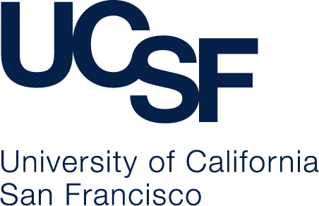
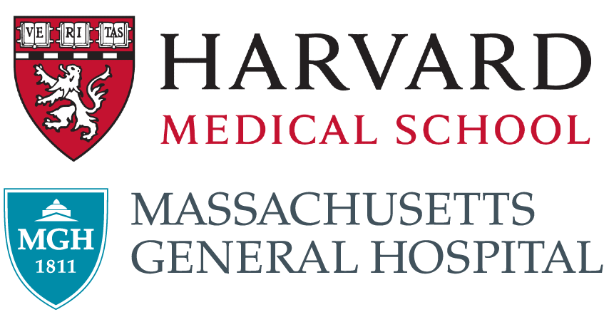

.. role:: underlined

Authors and Funding
===================

OpenTOPAS Software
~~~~~~~~~~~~~~~~~~

.. rst-class:: special

=========================================== ========================================================== 
|logo1|                                     |logo2|                                                    
=========================================== ========================================================== 
**University of California, San Francisco** **Massachusetts General Hospital, Harvard Medical School** 
|space|                                                                                                
:underlined:`Current collaborators`         :underlined:`Current collaborators`                        
|space|                                                                                                
**(PI) Bruce Faddegon (2018-2024)**         **(PI) Harald Paganetti (2009-2016)**                      
**José Ramos-Méndez**                       **Jan Schuemann**                                          
|space|                                                                                                
Jorge Naoki Dominguez Kondo                 Alejandro Bertolet                                         
Ramon Ortiz Catalan                         Wook-Geun Shin                                             
Thongchai A. M. Masilela                    Isaac Meyer                                                
|space|                                                                                                
:underlined:`Former collaborators`          :underlined:`Former collaborators`                         
|space|                                                                                                
Daren Sawkey                                Aimee McNamara                                             
Jungwook Shin                               Mauro Testa                                                
Pierluigi Piersimoni                        Hsiao-Ming Lu                                              
Lucas Burigo                                David Hall                                                 
Kyungdon Choi                               Robert Stewart                                             
Jhonatan Carrasco Hernandez                 Andrea Attili                                              
|space|                                     David J Carlson                                            
|space|                                     Alejandro Carabe-Fernández                                 
|space|                                     Hongyu Zhu                                                 
|space|                                     Yizheng Chen                                               
|space|                                     Wonmo Sung                                                 
|space|                                     Hoyeon Lee                                                 
|space|                                     Kira Grogg                                                 
|space|                                     Lisa Polster                                               
|space|                                     Niels Peters                                               
|space|                                     Giulia Tamborino                                           
|space|                                     Ilaria Rinaldi                                             
=========================================== ========================================================== 

Key External Collaborators
~~~~~~~~~~~~~~~~~~~~~~~~~~

- Japan PTSIM Collaboration (Nagaoka University, KEK, Hyogo Ion Beam Medical Center, Etc.)
- India FPGA Collaboration (C-DAC, OHSL, SAMEER, TMC, AIIMS)
- Laval University (L Bellevue et al.)
- Critically import: **OUR USERS**. Your feedback and contributions are imperative to our success!

OpenTOPAS Documentation
~~~~~~~~~~~~~~~~~~~~~~~

.. rst-class:: authors

====================    ============================
reST source code        * David Hall
Authors                 * Bruce Faddegon
                        * Jan Schuemann
                        * José Ramos-Méndez
                        * David Hall
                        * Hoyeon Lee
                        * Jungwook Shin
                        * Jorge Naoki Dominguez Kondo
                        * Ramon Ortiz Catalan
                        * Thongchai A. M. Masilela
User Contributions      * Aleksandra Biegun
                        * Fada Guan
====================    ============================

Funding Sources
~~~~~~~~~~~~~~~

Previous versions of OpenTOPAS (under the name TOPAS) received funding from both an NIH R01 research project grant, and an ITCR U24 grant. Further information about each grant can be found below:

- `TOPAS R01`_ 2009-2013 for proton therapy: “PBEAM: Fast and Easy Monte Carlo System for Proton Therapy, National Institute of Health (NIH) R01 CA140735,” **Harald Paganetti (PI, MGH)**
- `TOPAS R01 renewal`_ 2013-2016, for organ and cellular-effect biology (NIH) R01 CA140735. **Harald Paganetti (PI, MGH)**
- `TOPAS ITCR U24`_ 2018-2024 for further development and sustainment: "The TOPAS Tool for Particle Simulation, a Monte Carlo Simulation Tool for Physics, Biology and Clinical Research" NIH U24 CA215123, **Bruce Faddegon (PI, UCSF)**

Future funding for the OpenTOPAS project will be reflected here and in the News_ section of our website.

.. |space| unicode:: U+0020

.. _TOPAS R01: https://reporter.nih.gov/search/cwvk1K9IbE2oo9m5gXJyZg/projects

.. _TOPAS R01 renewal: https://reporter.nih.gov/search/SKpIWk19UUiAP_mzikKdoQ/projects

.. _TOPAS ITCR U24: https://reporter.nih.gov/search/nnhhnwKLs0SyRgxmkrECrw/projects?PI=7621859

.. _News: https://opentopas.github.io/news.html
